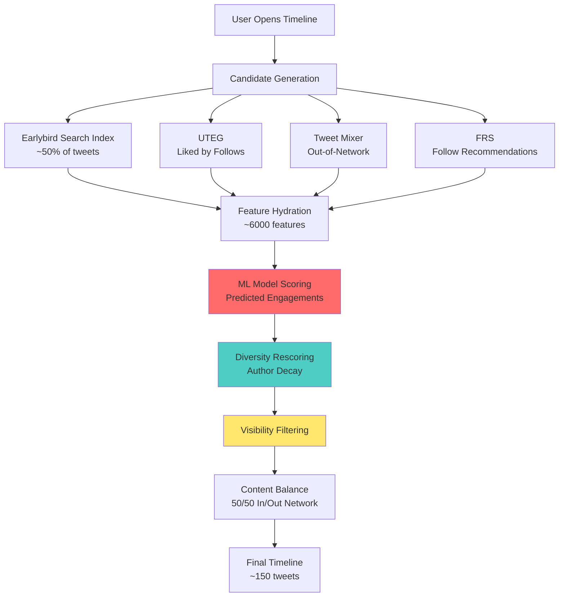
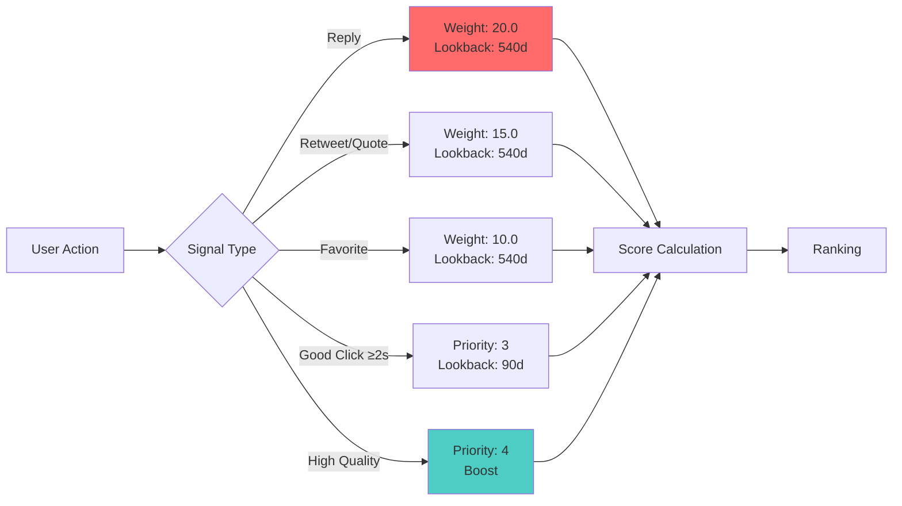

# X Algorithm Viral Growth Guide: How to Grow Your Account Using the Algorithm

> **Based on analysis of X's open-source recommendation algorithm codebase**  
> This guide shows you exactly how the algorithm works and how to use it to your advantage

---

## Table of Contents

1. [Executive Summary: Top 10 Growth Strategies](#executive-summary)
2. [Engagement Signals: What the Algorithm Actually Tracks](#engagement-signals)
3. [Ranking Optimization: How Tweets Get Scored](#ranking-optimization)
4. [Follower Growth: Getting Recommended to New Users](#follower-growth)
5. [Community Building: Leveraging SimClusters](#community-building)
6. [Interaction Optimization: Boosting Real Graph Scores](#interaction-optimization)
7. [Penalty Avoidance: What Kills Your Visibility](#penalty-avoidance)
8. [Content Strategy: Posting Frequency & Diversity](#content-strategy)
9. [Advanced Tactics: Combining Strategies](#advanced-tactics)
10. [Code References: Algorithm Implementation Details](#code-references)

---

## Executive Summary: Top 10 Growth Strategies {#executive-summary}

After digging through X's actual algorithm code, here are the **10 most important strategies** for growing your account:

### 1. **Focus on Replies, Not Just Likes**
- Replies are worth **twice as much** as likes (20.0 vs 10.0 in the algorithm)
- The algorithm remembers your replies for **540 days** (compared to just 90 days for recent engagement)
- This means one reply is as valuable as two likes
- Code reference: `HighQualitySourceSignalReplyWeight = 20.0` vs `HighQualitySourceSignalFavWeight = 10.0`

### 2. **Make People Actually Read Your Content**
- When someone clicks your tweet, they need to spend **at least 2 seconds** reading it for it to count as a "good click"
- For profile visits, they need to stay **at least 10 seconds** to count
- These "good clicks" get the highest priority in the algorithm (priority 4 vs the normal priority 3)
- Quick bounces don't help you - you need genuine engagement
- Code reference: `TweetClickFetcher.minDwellTimeMap` and `ProfileClickFetcher.minDwellTimeMap`

### 3. **Become Part of a Community**
- X organizes users into **145,000 different communities** based on who follows whom
- If you're in the top 20 million most-followed accounts, you can become "Known For" a specific community
- When someone favorites your tweet, your tweet's community profile updates **instantly** - it's not delayed
- Each favorite tells the algorithm which communities are interested in your content
- Code reference: `simclusters_v2/summingbird/storm/TweetJob.scala`

### 4. **Get Into "Liked By People You Follow"**
- This is how your tweets appear to people who don't follow you yet
- The algorithm tracks which tweets people like for **24-48 hours**
- If someone you follow likes your tweet, it can show up in other people's timelines
- This is one of the main ways to reach new audiences
- Code reference: `src/scala/com/twitter/recos/user_tweet_entity_graph/README.md`

### 5. **Don't Overpost - There's a Penalty**
- The algorithm actively prevents any single account from dominating someone's timeline
- Your second tweet of the day gets **50% less visibility** than your first
- Your third tweet gets even less, and so on
- The minimum visibility you can get is **25% of your original score** (no matter how many tweets you post)
- This means posting 2-3 times per day is optimal - more than that and you're wasting effort
- Code reference: `AuthorDiversityDiscountProvider` with `Decay = 0.5`, `Floor = 0.25`

### 6. **Understand Where Your Tweets Come From**
- About **half of all tweets** in the "For You" timeline come from a system called Earlybird
- This system ranks tweets based on how many retweets, replies, and likes they have
- Getting into this system is crucial because it's the biggest source of timeline content
- Code reference: `src/java/com/twitter/search/README.md`

### 7. **Build Your Reputation Score**
- X tracks how likely you are to interact with other users - this is your "Real Graph" score
- It's based on things like favorites, retweets, follows, profile views, and clicks
- Recent interactions matter more than old ones (the score decays over time)
- A higher score means you're more likely to be recommended to others
- Code reference: `src/scala/com/twitter/interaction_graph/README.md`

### 8. **Video Content Gets Special Treatment**
- Videos need to be watched for **at least 10 seconds OR 95% completion** to count as a quality view
- Even watching **50% of a video** counts as engagement (tracked for 90 days)
- Videos shorter than 10 seconds don't get these benefits
- Video engagement is tracked separately and can boost your visibility significantly
- Code reference: `VideoView_90D_Quality_V1` and `VideoView_90D_Playback50_V1`

### 9. **Get Recommended to New Followers**
- X uses several algorithms to suggest accounts to follow:
  - **STP**: Predicts mutual follows (people you both follow)
  - **SALSA**: Finds accounts through your mutual connections
  - **SIMS**: Finds accounts similar to you based on follower overlap
- Understanding these helps you get into the "People You May Know" suggestions
- Code reference: `follow-recommendations-service/common/src/main/scala/com/twitter/follow_recommendations/common/candidate_sources/`

### 10. **Avoid Getting Penalized**
- Getting blocked or reported is **catastrophic** - it's worth -20.0 points (the same as 2 replies!)
- Getting muted is also bad (-15.0 points)
- Even "Not Interested" clicks hurt you (-10.0 points)
- One negative signal can undo days of positive engagement
- Code reference: `HighQualitySourceSignalParams.scala`

---

## Engagement Signals: What the Algorithm Actually Tracks {#engagement-signals}

### How Different Actions Are Weighted

The algorithm doesn't treat all engagement equally. Here's how different actions stack up:

| Signal | Lookback Window | Priority | Weight (High Quality) | Used In |
|--------|----------------|----------|----------------------|---------|
| **Reply** | 540 days | 3 | **20.0** | USS, TwHIN, UTEG, FRS, Light Ranking |
| **Retweet** | 540 days | 3 | **15.0** | USS, TwHIN, UTEG, FRS, Light Ranking |
| **Quote Tweet** | 540 days | 3 | **15.0** | USS, TwHIN, UTEG, FRS, Light Ranking |
| **Favorite** | 540 days | 3 | **10.0** | USS, SimClusters, TwHIN, UTEG, FRS, Light Ranking |
| **Bookmark** | 540 days | 3 | **5.0** | USS |
| **Share** | 14 days | 3 | **5.0** | USS, FRS |
| **Tweet Click** | 90 days | 3 | 0.0 | USS, FRS, Light Ranking (as label) |
| **Good Tweet Click** (≥2s) | 90 days | 3 | 0.0 | USS |
| **Good Tweet Click** (≥5s) | 90 days | 3 | 0.0 | USS (dev) |
| **Good Tweet Click** (≥10s) | 90 days | 3 | 0.0 | USS (dev) |
| **Good Tweet Click** (≥30s) | 90 days | 3 | 0.0 | USS (dev) |
| **Video Quality View** (10s OR 95%) | 90 days | 3 | 0.0 | USS, SimClusters |
| **Video Playback 50%** | 90 days | 3 | 0.0 | USS |
| **Profile Visit** (≥10s) | 90 days | 3 | 0.0 | USS, FRS |
| **Profile Visit** (≥20s) | 90 days | 3 | 0.0 | USS (dev) |
| **Profile Visit** (≥30s) | 90 days | 3 | 0.0 | USS (dev) |
| **Notification Open** | 90 days | 3 | 0.0 | USS, SimClusters, TwHIN, FRS |
| **Ntab Click** | 90 days | 3 | 0.0 | USS, SimClusters, TwHIN, FRS |
| **High Quality Source** | N/A | **4** | N/A | USS (priority boost) |

**What This Means:**
- **Replies are worth twice as much** as likes (20.0 vs 10.0) - so encourage conversations!
- **Retweets and quote tweets** are worth 1.5x more than likes (15.0 vs 10.0)
- **The algorithm has a long memory** - it tracks core engagements for 540 days, so consistency over time really matters
- **Quick clicks don't count** - people need to actually read your content (2+ seconds for tweets, 10+ seconds for profiles)

### Signal Usage by Component

| Component | Primary Signals Used |
|-----------|---------------------|
| **USS (User Signal Service)** | All signals as features |
| **SimClusters** | Favorites, Video Views, Notification Opens, Ntab Clicks, Follows |
| **TwHIN** | Favorites, Retweets, Quote Tweets, Follows, Notification Opens, Ntab Clicks |
| **UTEG** | Favorites, Retweets, Quote Tweets, Replies |
| **FRS (Follow Recommendations)** | Follows, Favorites, Retweets, Quote Tweets, Replies, Shares, Clicks, Profile Visits, Notification Opens, Ntab Clicks |
| **Light Ranking** | Favorites, Retweets, Quote Tweets, Replies, Clicks, Video Views |

### Negative Signals (Penalties)

| Signal | Weight | Lookback Window | Impact |
|--------|--------|----------------|--------|
| **Block** | **-20.0** | Infinite | Highest penalty |
| **Report** | **-20.0** | 90 days | Highest penalty |
| **Mute** | **-15.0** | Infinite | High penalty |
| **Not Interested** | **-10.0** | 90 days | Medium penalty |
| **Unfavorite** | Tracked | 540 days | Negative signal (no weight) |

**This is critical:** Negative signals can completely destroy your visibility. Just one block (-20.0) cancels out 2 replies (+20.0) or 4 likes (+10.0 each). Avoid negative feedback at all costs.

---

## Ranking Optimization: How Tweets Get Scored {#ranking-optimization}

### How Your Tweet Gets Into Someone's Timeline

Here's the journey your tweet takes:

```
1. Candidate Generation (~1 billion tweets considered)
   ↓
2. Feature Hydration (~6000 data points collected about each tweet)
   ↓
3. Scoring (Machine learning predicts engagement probability)
   ↓
4. Diversity Rescoring (Prevents one account from dominating)
   ↓
5. Filtering & Mixing (Removes spam, balances content)
   ↓
6. Final Timeline (~150 tweets shown to user)
```

Only about 0.000015% of tweets make it through this process!

### How Scores Are Combined

When your tweet appears to someone who doesn't follow you, the algorithm combines two scores:

```
Final Score = (Your Reputation Score × 1.0) + (Earlybird Score × Variable Multiplier)
```

- Your reputation score (Real Graph) always counts fully
- The Earlybird score multiplier changes based on the situation
- Higher combined score = better chance of appearing in timelines

**Code reference:** `CombinedScoreAndTruncateTransform.scala`

### Predicted Engagement Scores

The algorithm predicts probabilities for multiple engagement types:

| Engagement Type | Feature Name | Description |
|----------------|--------------|-------------|
| **Favorite** | `PREDICTED_IS_FAVORITED` | Probability of like |
| **Retweet** | `PREDICTED_IS_RETWEETED` | Probability of retweet |
| **Reply** | `PREDICTED_IS_REPLIED` | Probability of reply |
| **Quote** | `PREDICTED_IS_QUOTED` | Probability of quote tweet |
| **Click** | `PREDICTED_IS_CLICKED` | Probability of click |
| **Good Click** | `PREDICTED_IS_GOOD_CLICKED_V1/V2` | Click + dwell time + downstream engagement |
| **Profile Click** | `PREDICTED_IS_PROFILE_CLICKED` | Probability of profile visit |
| **Video Playback 50%** | `PREDICTED_IS_VIDEO_PLAYBACK_50` | 50% video watched |
| **Video Quality View** | `PREDICTED_IS_VIDEO_QUALITY_VIEWED` | 10s OR 95% watched |
| **Dwell** | `PREDICTED_IS_DWELLED` | Time spent viewing |
| **Share** | `PREDICTED_IS_SHARED` | Probability of share |
| **Bookmark** | `PREDICTED_IS_BOOKMARKED` | Probability of bookmark |
| **Negative Feedback** | `PREDICTED_IS_NEGATIVE_FEEDBACK` | Probability of negative action |

**Code:** `TimelinesSharedFeatures.scala`

### The Posting Frequency Penalty

X actively prevents any single account from taking over someone's timeline. Here's how it works:

**The Math:**
```
Your Score = (1 - 0.25) × (0.5^position) + 0.25
```

**What This Means:**
- **Your first tweet**: Gets 100% of its potential score
- **Your second tweet**: Gets 62.5% (about 63% of the first one)
- **Your third tweet**: Gets 43.75% (about 44% of the first one)
- **Your fourth tweet**: Gets 34.375% (about 34% of the first one)
- **After that**: It bottoms out at 25% minimum

**The Bottom Line:**
Posting multiple times per day is fine, but each additional tweet gets significantly less visibility. Your 2nd tweet of the day gets about 63% of the visibility, your 3rd gets about 44%, and so on. This applies whether you have 10 followers or 10 million.

**Code reference:** `AuthorDiversityDiscountProvider.scala` and `AuthorBasedListwiseRescoringProvider.scala`

### The 50/50 Split

X tries to keep timelines balanced:
- **About 50%** of tweets come from accounts you follow
- **About 50%** are recommended tweets from accounts you don't follow

**Why This Matters:**
Even if someone doesn't follow you, you can still appear in their timeline through recommendations. This is how accounts grow - by reaching people who don't follow them yet.

**Code reference:** `home-mixer/README.md`

---

## Follower Growth: Getting Recommended to New Users {#follower-growth}

### How X Suggests Accounts to Follow

X uses five different algorithms to recommend accounts. Understanding these helps you get recommended to the right people:

#### 1. **STP (Strong Tie Prediction) - "People You May Know"**
- This predicts who you're likely to follow based on mutual connections
- **For new users** (under 30 days old): Uses two steps - first finds mutual follows and contacts, then finds their mutual follows
- **For everyone else**: Uses a statistical method to find accounts with similar mutual follow patterns
- Considers: Your reputation score, phone/email contacts, mutual connections, and your overall account reputation

**Code reference:** `follow-recommendations-service/common/src/main/scala/com/twitter/follow_recommendations/common/candidate_sources/stp/README.md`

**How to Use This:**
- Build mutual follows with people in your target audience
- If privacy allows, connect your phone/email contacts
- Build your account reputation (TweepCred) - this is like a PageRank score for your account

#### 2. **SALSA - Finding Accounts Through Connections**
- Uses a mathematical approach to find accounts through your network
- Looks at: You, your contacts, mutual follows, and recent follows/followers
- Then finds accounts that are connected to those people
- Basically finds accounts through your extended network

**Code reference:** `follow-recommendations-service/common/src/main/scala/com/twitter/follow_recommendations/common/candidate_sources/salsa/README.md`

**How to Use This:**
- Build strong mutual follow relationships
- Engage with accounts that your target audience follows
- The more mutual connections you have, the better

#### 3. **SIMS - Finding Similar Accounts**
- Finds the top 1,000 accounts most similar to you
- **CosineFollow**: Compares who follows you vs who follows them
- **CosineList**: Compares which lists you're both on
- **Follow2Vec**: Uses AI to find similar accounts based on follow patterns (only for top 10M accounts)

**Code reference:** `follow-recommendations-service/common/src/main/scala/com/twitter/follow_recommendations/common/candidate_sources/sims/README.md`

**How to Use This:**
- Get added to relevant lists (this helps a lot!)
- Build a follower base similar to accounts you want to be like
- If you're a top account, your follow patterns matter more

#### 4. **Real Graph - Your Interaction Score**
- Predicts how likely someone is to interact with you
- Based on: likes, retweets, follows, profile views, and clicks
- Recent interactions count more than old ones (the score decays over time)

**Code reference:** `follow-recommendations-service/common/src/main/scala/com/twitter/follow_recommendations/common/candidate_sources/real_graph/README.md`

**How to Use This:**
- Get people to actually interact with your content (likes and retweets are best)
- Encourage profile visits - if someone stays on your profile for 10+ seconds, it counts as a "good click"

#### 5. **Recent Engagement - What You've Interacted With**
- Shows accounts you've recently engaged with (liked, retweeted, replied to, or visited)
- Tracks both obvious actions (likes) and subtle ones (profile visits)

**Code reference:** `follow-recommendations-service/common/src/main/scala/com/twitter/follow_recommendations/common/candidate_sources/recent_engagement/README.md`

**How to Use This:**
- Encourage your target audience to engage with your content
- Profile visits really matter - especially if they stay for 10+ seconds

### The "Followed By X Users" Effect

When X recommends you, it shows how many people follow you. This social proof matters.

**Code reference:** `follow-recommendations-service/README.md`

**How to Use This:**
- Build an initial follower base - even small numbers help
- Focus on getting quality followers who actually engage, not just numbers

---

## Community Building: Leveraging SimClusters {#community-building}

### What Are SimClusters?

- X has identified **145,000 different communities** based on who follows whom
- The **top 20 million most-followed accounts** get assigned to communities (called "Known For")
- Each account can only be "Known For" one community (to keep things simple)

### How Your Tweets Get Tagged by Community

Here's how it works:

1. **When you post**: Your tweet starts with no community tags
2. **When someone favorites it**: Their community interests get added to your tweet
3. **Updates instantly**: This happens in real-time, not delayed
4. **Your tweet's profile**: Over time, your tweet reflects which communities engaged with it

**Code reference:** `src/scala/com/twitter/simclusters_v2/README.md`

### How to Become "Known For" a Community

To get assigned to a community:
1. Be in the **top 20 million most-followed accounts**
2. Have **followers similar** to other accounts in that community
3. The algorithm uses statistical sampling to figure out which community you belong to

**Code reference:** `simclusters_v2/scalding/update_known_for/UpdateKnownFor20M145K2020.scala`

### Producer Embeddings (More Detailed Than "Known For")

- This is more detailed than the simple "Known For" tag
- You can have connections to multiple communities
- Calculated by comparing your followers to different community interests
- Used to recommend your tweets to people based on what you post

**Code reference:** `simclusters_v2/scalding/embedding/ProducerEmbeddingsFromInterestedIn.scala`

### How Users' Interests Are Tracked

- Each user has an "InterestedIn" profile showing their long-term interests
- Calculated from who they follow and which communities those accounts belong to
- Used to recommend tweets to users based on their interests

**Code reference:** `simclusters_v2/scalding/InterestedInFromKnownFor.scala`

### How to Use This for Growth

1. **Pick a specific community** and focus on becoming "Known For" it
2. **Get favorites from people in that community** - each favorite updates your tweet's community profile
3. **Build followers who are similar** - similar followers help you get assigned to the right community
4. **Engage with community leaders** - their followers likely share the same interests

---

## Interaction Optimization: Boosting Real Graph Scores {#interaction-optimization}

### What Is Real Graph?

Real Graph predicts how likely someone is to interact with you. Think of it as your "interaction reputation score."

**How It's Built:**
- **Positive examples**: People who actually interacted with you
- **Negative examples**: Friends of friends who didn't interact (to teach the model what NOT to recommend)
- Uses machine learning (gradient boosting) to make predictions

**What It Considers:**
- How many tweets, follows, likes, retweets, replies you have
- Profile views and tweet clicks
- Address book connections (if privacy allows)
- Various other behavior patterns

**Code reference:** `src/scala/com/twitter/interaction_graph/README.md`

### Interaction Types Tracked

**Public Engagements:**
- Favorites
- Retweets
- Follows
- Replies

**Private Engagements:**
- Profile views
- Tweet clicks
- Address book connections (with opt-in)

### How Your Score Changes Over Time

Real Graph uses a "decayed sum" - meaning recent interactions matter more than old ones:
- Interactions are aggregated daily
- Older interactions gradually count less
- The final score predicts how likely someone is to interact with you

**Code reference:** `src/scala/com/twitter/interaction_graph/README.md`

### Special Help for New Accounts

If your account is less than 30 days old, profile views count extra:
- Profile visits get added to your engagement score
- This helps new accounts get discovered more easily

**Code reference:** `RealTimeRealGraphClient.scala`

### How to Build Your Score

1. **Get people to visit your profile** - especially from your target audience (they need to stay 10+ seconds)
2. **Get public engagements** - likes, retweets, and replies all boost your score
3. **Connect address book contacts** - if privacy allows, this helps
4. **Stay consistent** - since recent interactions matter more, keep engaging regularly

---

## Penalty Avoidance: What Kills Your Visibility {#penalty-avoidance}

### What Gets Your Content Filtered

X has multiple filters that can hide or remove your content. Here's what to avoid:

#### Tweet-Level Filters

| Filter | Description | Impact |
|--------|-------------|--------|
| **SpamHighRecallTweetLabelDropRule** | High recall spam detection | Drop tweet |
| **LowQualityTweetLabelDropRule** | Low quality content | Drop tweet |
| **DuplicateContentTweetLabelDropRule** | Duplicate/repeated content | Drop tweet |
| **NsfwHighPrecisionTweetLabelRule** | NSFW content (high precision) | Filter/avoid |
| **GoreAndViolenceTweetLabelRule** | Violent content | Filter/avoid |
| **UntrustedUrlTweetLabelDropRule** | Untrusted URLs | Drop tweet |
| **DownrankSpamReplyTweetLabelRule** | Spam replies | Downrank |
| **AutomationTweetLabelRule** | Automated/bot behavior | Filter |
| **DoNotAmplifyDropRule** | "Do Not Amplify" label | Drop tweet |

**Code:** `visibilitylib/src/main/scala/com/twitter/visibility/rules/VisibilityPolicy.scala`

#### User-Level Filters

| Filter | Description | Impact |
|--------|-------------|--------|
| **AbusiveRule** | Abusive behavior | Filter user |
| **LowQualityRule** | Low quality account | Filter user |
| **ReadOnlyRule** | Read-only account | Filter user |
| **SpamHighRecallRule** | High recall spam | Filter user |
| **CompromisedRule** | Compromised account | Filter user |
| **DoNotAmplifyNonFollowerRule** | "Do Not Amplify" for non-followers | Filter user |

**Code:** `visibilitylib/src/main/scala/com/twitter/visibility/rules/VisibilityPolicy.scala`

### Negative Signal Weights

| Signal | Weight | Lookback |
|--------|--------|----------|
| **Block** | **-20.0** | Infinite |
| **Report** | **-20.0** | 90 days |
| **Mute** | **-15.0** | Infinite |
| **Not Interested** | **-10.0** | 90 days |

**Code:** `tweet-mixer/server/src/main/scala/com/twitter/tweet_mixer/param/HighQualitySourceSignalParams.scala`

### What Counts as "High Quality"

The algorithm tracks "high quality" accounts and tweets:
- **HighQualitySourceTweet**: Tweets that get high-quality engagement
- **HighQualitySourceUser**: Accounts that consistently get high-quality engagement
- These get **Priority 4** (the highest) vs the normal Priority 3

**Code reference:** `USSFeatures.scala`

### How to Avoid Getting Penalized

1. **Never get blocked** - it's worth -20.0 points, which cancels out 2 replies!
2. **Avoid reports** - same massive penalty as blocks
3. **Don't get muted** - -15.0 points is still very bad
4. **Focus on quality, not quantity** - aim for "high quality" signals
5. **Don't look like spam** - avoid duplicate content, automation, or spammy behavior
6. **Follow community guidelines** - NSFW, abusive, or violent content gets filtered immediately

---

## Content Strategy: Posting Frequency & Diversity {#content-strategy}

### The Posting Penalty Explained

**The key finding:** X actively prevents any single account from taking over someone's timeline by reducing visibility for each additional tweet.

**Decay Formula:**
```
Score = (1 - Floor) × (DecayFactor^position) + Floor
```

**Default Values:**
- Decay Factor: **0.5** (50% reduction per position)
- Floor: **0.25** (minimum 25% of original score)

**Impact:**
- 1st tweet: 100% score
- 2nd tweet: 62.5% score
- 3rd tweet: 43.75% score
- 4th tweet: 34.375% score
- 5th+ tweet: Approaches 25% floor

**Code:** `AuthorDiversityDiscountProvider.scala`

### The Best Posting Strategy

**Here's what works best:**
1. **Post 2-3 times per day** for maximum impact
2. **Space your tweets out** - don't post them all at once
3. **Remember: quality beats quantity** - your 2nd tweet gets 63% visibility, your 3rd gets 44%
4. **This applies to everyone** - whether you have 10 followers or 10 million, the same rules apply

### Content Balance

The algorithm maintains **~50/50 balance** between:
- **In-Network**: Accounts you follow
- **Out-of-Network**: Recommended content

**Implication:** Even if you're not followed, you can still appear in timelines via out-of-network recommendations.

### Candidate Source Limits

| Source | Default Max Fetch | Description |
|--------|------------------|-------------|
| **In-Network (Earlybird)** | 600 tweets | From accounts you follow |
| **Tweet Mixer** | 400 tweets | Out-of-network coordination |
| **UTEG** | 300 tweets | "Liked by people you follow" |
| **FRS** | 100 tweets | Follow recommendations |

**Code:** `ScoredTweetsParam.scala`

### When Things Count (Timing Matters)

- **How long the algorithm remembers:**
  - Core engagements (likes, retweets, replies): **540 days** - that's over a year and a half!
  - Recent engagements: **90 days**
  - Shares: **14 days** (shortest window)
- **UTEG ("Liked by people you follow")**: Only **24-48 hours** - very short window
- **SimClusters updates**: Happen **instantly** when someone favorites your tweet

**What This Means:**
- **Long-term consistency really matters** - the algorithm remembers your performance for 540 days
- **Recent performance counts too** - 90-day lookback means you need to stay active
- **Real-time engagement is powerful** - favorites update your community profile instantly

---

## Advanced Tactics: Combining Strategies {#advanced-tactics}

### Powerful Combinations

#### 1. **The Reply + Good Click Combo**
- Post content that makes people want to reply
- Make sure they actually read it (2+ seconds)
- **Why it works**: Replies are worth 20.0 points, plus good clicks get priority boost

#### 2. **The Video + Community Strategy**
- Create videos that are at least 10 seconds long
- Target a specific community (SimClusters)
- Get favorites from people in that community (this updates your tweet's community profile)

#### 3. **The UTEG + Real Graph Strategy**
- Get likes from accounts with high reputation scores
- Your tweet appears in "Liked by people you follow"
- This builds your own reputation score for future recommendations

#### 4. **The Follow Recommendation + Engagement Strategy**
- Build mutual follows (helps with STP algorithm)
- Get profile visits that last 10+ seconds (boosts Real Graph score)
- Encourage favorites (updates SimClusters community profile)

#### 5. **The Diversity + Quality Strategy**
- Post 2-3 times per day (the sweet spot)
- Focus on getting high-quality signals (Priority 4)
- Avoid negative signals at all costs (blocks, reports, mutes)

### Viral Growth Formula

**Optimal Combination:**
```
High Priority Signals (Priority 4)
+ Reply Engagement (Weight 20.0)
+ Good Clicks (≥2s dwell)
+ Video Quality Views (≥10s OR 95%)
+ SimClusters Community Affiliation
+ Real Graph Score Building
+ Follow Recommendation Algorithms
- Zero Negative Signals
= Maximum Visibility
```

---

## Code References: Algorithm Implementation Details {#code-references}

### Key Files Analyzed

#### Engagement Signals
- `RETREIVAL_SIGNALS.md` - Complete signal catalog
- `user-signal-service/thrift/src/main/thrift/signal.thrift` - Signal definitions
- `tweet-mixer/server/src/main/scala/com/twitter/tweet_mixer/feature/USSFeatures.scala` - Feature extraction
- `tweet-mixer/server/src/main/scala/com/twitter/tweet_mixer/param/HighQualitySourceSignalParams.scala` - Signal weights

#### Ranking & Scoring
- `home-mixer/server/src/main/scala/com/twitter/home_mixer/product/scored_tweets/scorer/` - Scoring mechanisms
- `src/scala/com/twitter/timelines/prediction/features/common/TimelinesSharedFeatures.scala` - Feature definitions
- `timelineranker/server/src/main/scala/com/twitter/timelineranker/uteg_liked_by_tweets/CombinedScoreAndTruncateTransform.scala` - Score combination

#### Follow Recommendations
- `follow-recommendations-service/README.md` - FRS architecture
- `follow-recommendations-service/common/src/main/scala/com/twitter/follow_recommendations/common/candidate_sources/` - All algorithms

#### SimClusters
- `src/scala/com/twitter/simclusters_v2/README.md` - SimClusters algorithm
- `simclusters_v2/summingbird/storm/TweetJob.scala` - Real-time tweet embeddings

#### Real Graph
- `src/scala/com/twitter/interaction_graph/README.md` - Real graph model
- `follow-recommendations-service/common/src/main/scala/com/twitter/follow_recommendations/common/clients/real_time_real_graph/RealTimeRealGraphClient.scala` - Real graph usage

#### Visibility & Penalties
- `visibilitylib/src/main/scala/com/twitter/visibility/rules/VisibilityPolicy.scala` - All visibility rules

#### Diversity & Content Balance
- `home-mixer/server/src/main/scala/com/twitter/home_mixer/product/scored_tweets/scorer/AuthorDiversityDiscountProvider.scala` - Diversity decay
- `home-mixer/server/src/main/scala/com/twitter/home_mixer/product/scored_tweets/param/ScoredTweetsParam.scala` - Diversity parameters

### Algorithm Flow Diagram



### Signal Priority Flow



---

## Conclusion

This guide is based on X's actual open-source algorithm code. Here's what matters most for growing your account:

1. **Focus on high-value actions** - replies are worth twice as much as likes
2. **Make people actually engage** - quick clicks don't count, you need real attention
3. **Build community connections** - get assigned to a SimClusters community
4. **Post the right amount** - 2-3 times per day is optimal, more hurts you
5. **Avoid penalties** - one block can undo days of work
6. **Use follow algorithms** - understand how STP, SALSA, SIMS, and Real Graph work
7. **Build your reputation** - get interactions from your target audience
8. **Target multiple systems** - Earlybird, UTEG, Tweet Mixer, and FRS all matter

**Remember:** The algorithm uses about 6,000 different data points and multiple machine learning models. This guide focuses on the most important ones that you can actually control.

**Last Updated:** Based on X Algorithm open-source repository analysis

---

## Appendix: Quick Reference

### Top Engagement Signals (By Weight)
1. Reply: **20.0**
2. Retweet: **15.0**
3. Quote Tweet: **15.0**
4. Favorite: **10.0**
5. Bookmark: **5.0**
6. Share: **5.0**

### Dwell Time Thresholds
- **Good Tweet Click**: ≥2 seconds
- **Good Profile Click**: ≥10 seconds
- **Video Quality View**: ≥10 seconds OR 95% watched
- **Video Playback 50%**: 50% watched

### Author Diversity Decay
- **Decay Factor**: 0.5 (50% per position)
- **Floor**: 0.25 (25% minimum)
- **Optimal Frequency**: 2-3 tweets/day

### Negative Signal Penalties
- **Block**: -20.0
- **Report**: -20.0
- **Mute**: -15.0
- **Not Interested**: -10.0

### Lookback Windows
- **Core Engagements**: 540 days
- **Recent Engagements**: 90 days
- **Shares**: 14 days
- **UTEG**: 24-48 hours

---

*This guide is based on analysis of X's open-source recommendation algorithm. Algorithm parameters may change over time.*
